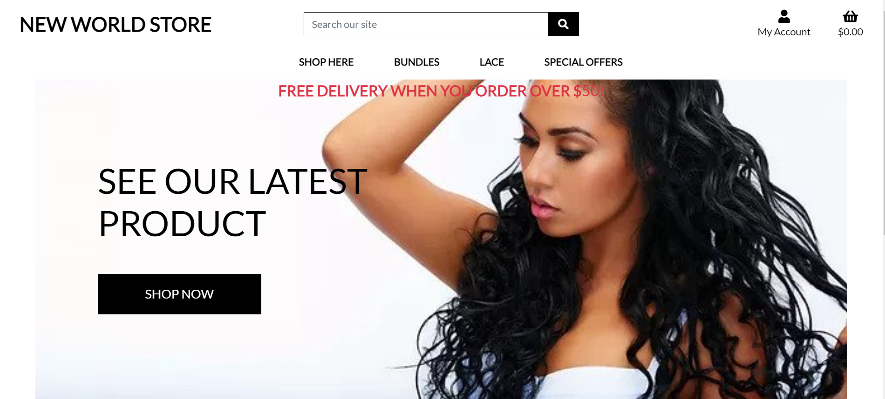

# ***New World Salon***

New World Store is a real-life project intended to be an e-commerce store for New World Salons located in Stockholm Sweden. Customers would be able to order and buy different hair extensions, attachment, and bundles, it is user friendly, simple to use and intuitive. New World Store is the Final Milestone Project designed by Emem Simon Inyangudom.

## ***UX***

### ***User Goals***

*	Simple, clear, and concise information about products categories, types, sizes.
*	Clear description about each product, search & sort options without having to go through all products.
*	Clear information with images of product selected in cart.
*	Secured checkout with all necessary shipping information.
*	Intuitive user profile with save options for user’s order and information from previous order.
*	Ability to return faulty products and review/complain about a product.

### ***Business Goals***

*	Allow clients from the any location access to buy and product and increase our sales.
*	To eliminate restrictions of time, location, and distance through web sales globally which will in-turn increase the business turn over.
*	Create a platform users can trust for safe and efficient transactions.
*	Create a platform where our services and products can reach more people beyond our location.
*	Expand business potential for the stores with online store as a means of publicity.

## ***User Stories***

### ***Persona***

Ivonne lives in Oslo and loves to hair an hair extension to make her hair longer, she checks online or social media for salons with good reviews from customer experience and satisfaction. She discovers that new world salons have multiple 5 star review and wonders if she could buy quality extensions from New World Stores since she is miles away in Oslo from Stockholm. She checks online and discovers New World Salon Online store where she could have access to same quality products the Salon offers her clients and she visit the website.

*	She visits the store online and discovers she can have same access to all products online.
*	She can be registered safely as a user.
*	She can search, sort, select products and place them in cart with ease.
*	She can place multiple products in her and return to products, delete products she mistakenly placed in her cart.
*	She checkout and pays securely with stripe payments.
*	She can add shipping address, save them in her profile for future use, edit and correct them.

Anders is customer who comes to treat and fix his dreadlocs, he his planning to come for a dreadlock detox and reconstruction. Knowing detox products are always high in demand, he checks online:
*	He goes online to buy the detox liquid.
*	He logs in to his profile and books an appointment through our appointment integration.
*   He avoids waste of time coming and no knowing if hair fix product is available.

### ***Color & Text***

#### ***Text***

*  Lato
*  Geneva

#### ***Color***

*  #aab7c4
*  #000
*  #111b15
*  #a3473f

## ***Wirefarmes***

### ***Desktop View***

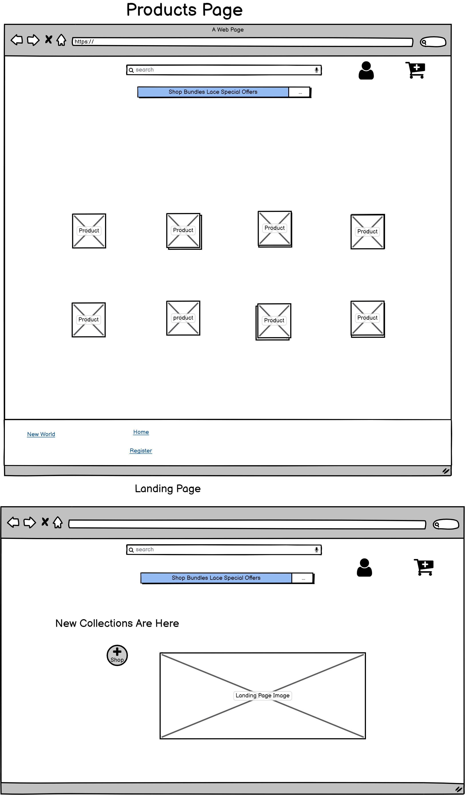

###  ***Tablet***

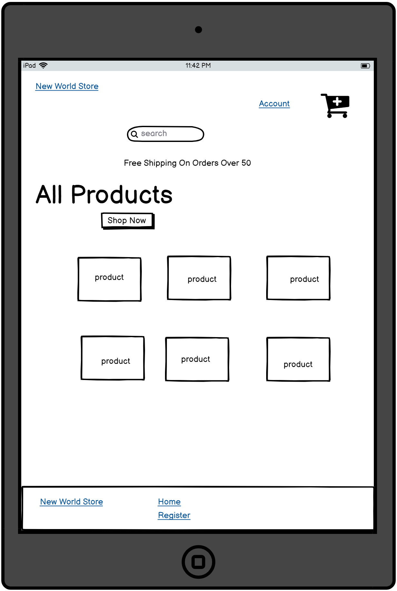

### ***Mobile View***

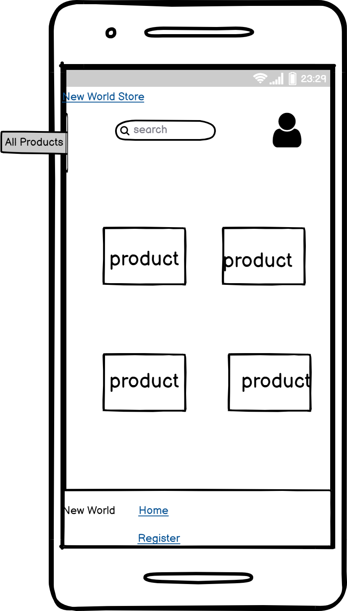

##  ***Features***

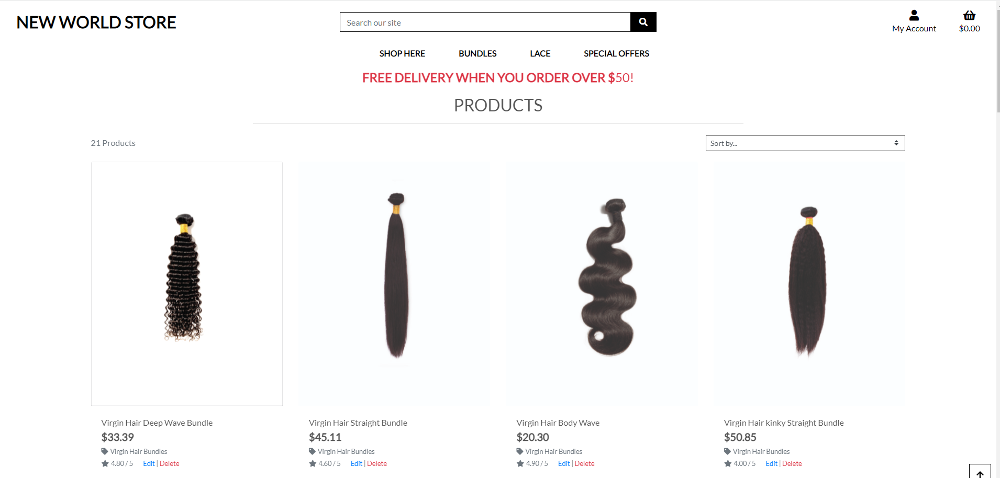
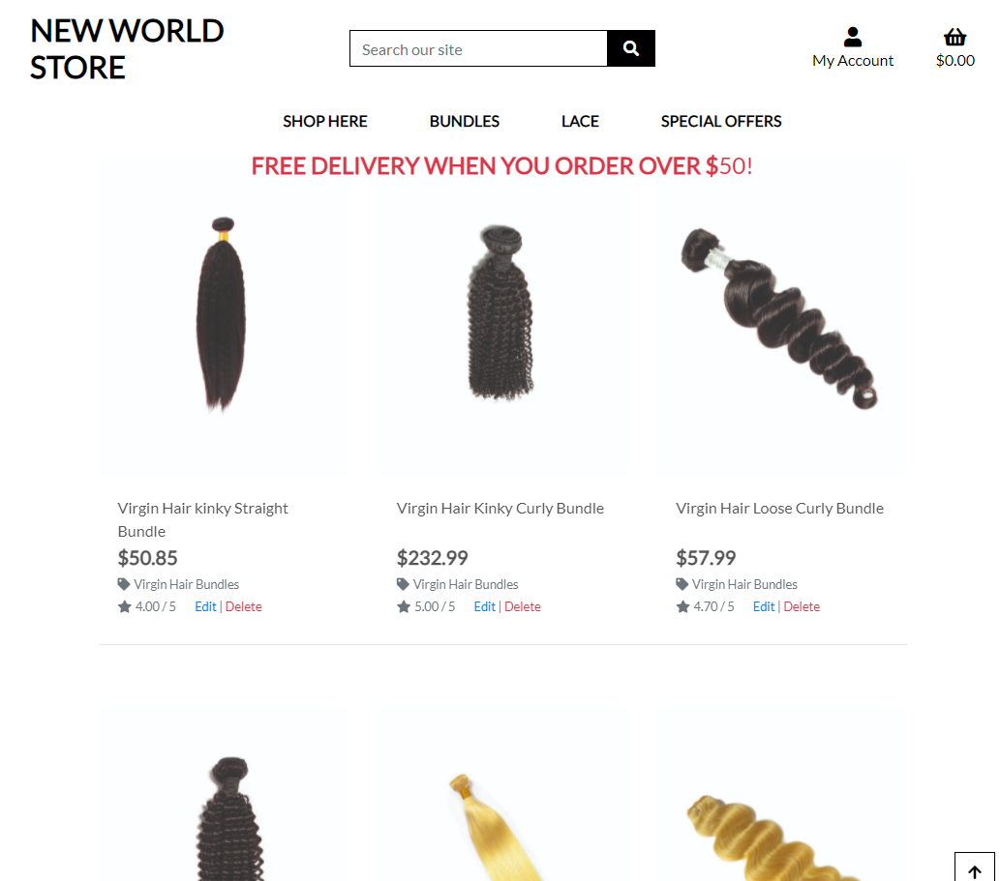
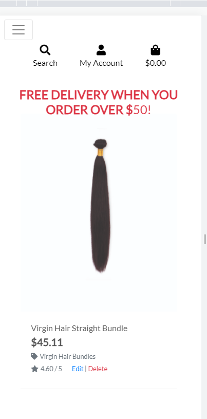

*	Navbar: All navigation links are functional and routed to the right pages, the bar are well coloured with hover effects for identification by users.
*	Product Page: Each has proper id, clear images and proper but simple description to avoid misinformation and mistakes by buyers.
*	Authentication: All users must register and confirm their registration through their registered emails, all necessary information about buyers are required to avoid orders being made and products not being delivered.
*	Search Engine: A functional search to sort and filter product through name, price, category or even words or description for quick and easy access to products instead of having to go through each product. 
*	Shopping Cart: Customers can add products to the cart with images, information of the product and product id clearly display. Number of products added and ability to delete and/or update corrections on selected products.
*	Checkout Page: Checkout that request proper shipping information, necessary message display in case there is problem with checking out. Proper integration with Stripe Payment for card payment.
*	Return Product Page: Customers can return damage or faulty products through their user profile by login in filling a product return form with all necessary information and reason for product return.
*	Feedback/Complaints Page:  Customers are allowed to give reviews, feedback and or complaints regarding all product for product rating.
*	User Profile: A profile page form that requires new users to fill and auto saved for user on return to their profile if they so desire. The profile information can be update and edited later.
*	Footer: A footer with the logo of the store and access to easily go back to necessary sections from the footer. Contact information and social media links.

### ***Information Architecture/Model***

#### ***Categories***

A Model to arranged different products to different categories for easy sorting and arrangement.

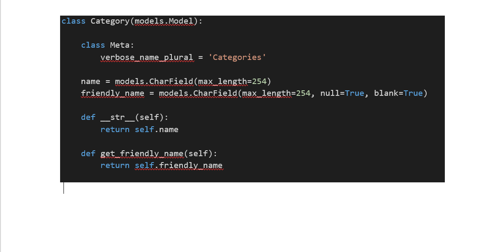

### ***Products***

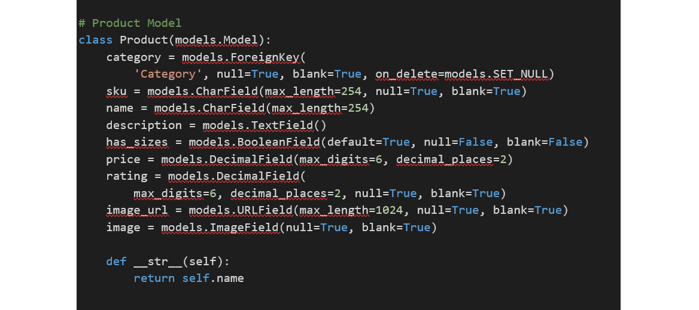

### ***Product Return***

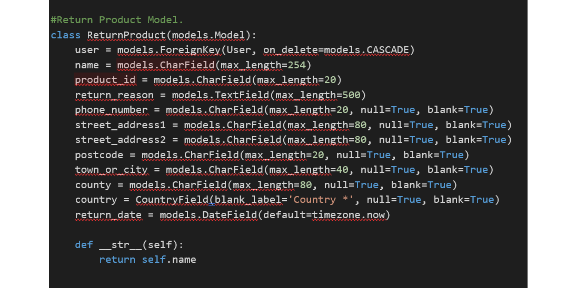

### ***Feedback***

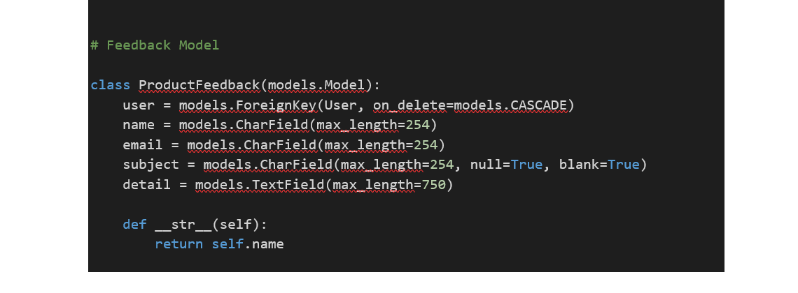

###  ***Technology***

####  ***Tools***

*	Balsamaic used for wireframe design.
*	Adobe for image resize and compression.
*	Git for version control
*	GitHub used to store and share project code remotely.
*	Heroku for hosting of the website.
*	Coolors.co for color palette generation.
*	Stripe payment infrastructure used to integrate card validation and payments securely.
*	Django python web framework for fast development and professional design.

###  ***Libraries***

*	Bootstrap To simplify the responsiveness and the structure of the website.
*	Google Fonts for font styling.
*	jQuery To simplify DOM manipulation.
*	Font Awasome To incorporate icons.
*	Jinja Framework Used for template execution and code re-usability.

###  ***Programming Tech Languages***

*	HTML
*	CSS
*	Javascript
*	Python

###  ***Databases***

*	PostgreSQL
*	Sqlite
*	AWS S3

###  ***Testing***

All apps were tested for functionality, error and lope holes and found to work as intended. The navigation links are all pointed to right pages; user authentication is also functional. Manual testing was also carried out, any visitor to the website should have the following experiences through testing:
*	I arrive at the landing page through browsing the url to the website.
*	All the products were accessed and displayed when I clicked the shop Now button.
*	I was able to search and sort products on the search.
*	I searched for products using prices, categories and words and got the desired results.
*	I clicked on product and individual product image was properly displayed, information of product and price was also visible.
*	I was able to add product to the cart by clicking on add button, increase, and reduce product quantity with the (+/-) button, and got message to confirm add success
*	I selected more products to be sure the add product works properly and clicked on secured checkout which to me to the checkout page successfully.
*	I was able to review product, leave feedback and use the return product form without any error.
*	I filled my information on the checkout form and used the stripe test card to check successful order payment.
*	I went to event in my Stripe and confirm the successful status of my intent through the webhook.
*	I checked to get a confirmation email for the successful payment.
*	I clicked on the link for the profile page to see that order history with all the necessary details are available.
*	I clicked on the return product form and filled the necessary details, submitted, and got a success confirmation.
*	I used the cancel order form to cancel, and it functioned properly.
*	The Stripe Test card used are: 4242 4242 4242 4242 07/26 789----without authentication And 5555 5555 5555 4444 04/27 567 with authentication.

The following code online validator and beautifier tools were use:
*	Freeformatter: For Html codes arrangement and formatting.
*	ExtendsClass: To validate and beautify python codes
*	BeautyTools: To validate and beautify JavaScripts codes.

### ***Deployment***

I deployed on Heroku and the following steps were taken during deployment;

*	Sign up on Heroku and create app to host the project code
*	Create a free plan of PosgreSQL database
*	Install dj-database-url and psycho2-binary
*	Setup the setting of the database on settings.py
*	Install all necessary plugins and freeze requirements.txt to ensure heroku runs properly
*	Ensure all sensitive key are save in (.env) or env.py and also ensure they are saved on environment variable in Heroku. See (requirements.txt)
*	Connect Heroku to repository on Heroku for automatic deployment.
*	Create AWS account and open S3, create group user and generate policy
*	Create S3 bucket to hold all the static and image files.
*	Connect S3 to repository and Heroku with AWS keys.
*	Commit and push from your repository, and confirm your images and static are loadrd on AWS.
*	To run on gitpod ensure all the plugin listed on requirements.txt is installed and DEVELOP equals True
*	Ensure all fixtures are loaded with 'python3 manage.py loaddata '
*	Ensure all models are migrated when created and also after any chenges are made on them.
The Deployed App can be accessed on Heroku with the link Below:

*	https://new-world-salon.herokuapp.com/

### ***Limitations***

*	Create functionality for potential salon client to book and deliver product to the salon for direct service instead or shipping to themselves first and before coming to salon.
*	Password recovery is not yet implemented.
*	Live chat help users with their orders.

###  ***Credit***

####  ***Media***

All the images used in this project including the landing page were source from newworldsalons.store

####  ***Acknowledgement***

New World Store: is a pet project for the student (Emem)which Hope to continue to develop and deploy to real life use in the nearest future. During this project, I have used some educational materials and hereby acknowledge them:  

*	Boutique Ado: Code Institute Dublin mock lecture project for Django Frame Works.
*	https://www.youtube.com/watch?v=tJXt0HW0Id8
*	https://www.youtube.com/watch?v=IVyc06bASSg
*	https://www.youtube.com/watch?v=jmX27FrCqqs

### ***Special Thanks***

To Code Institute Student care and tutors for supporting me through this project, I would not have completed this programme without your guidance especially when I almost gave up due to the challenges that came with Covid-19.

####   ***Contact***

*  zappy4chat@yahoo.com

